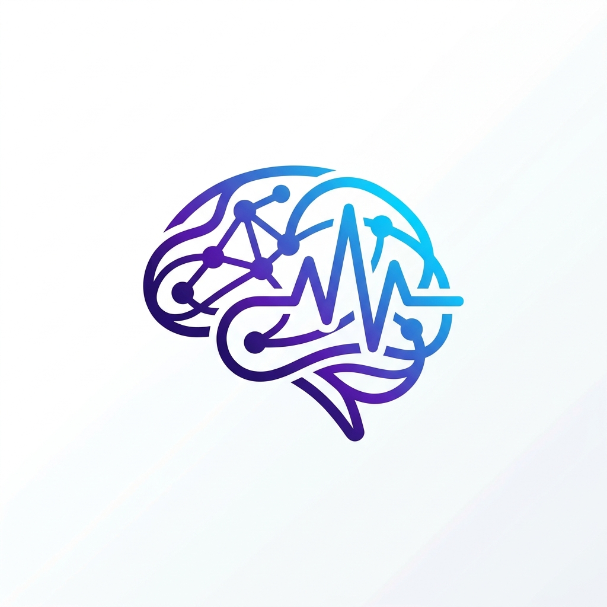

# AKVS IntelliState

<p align="center">
  
</p>

**The reactive state management library that understands your users.**

[](https://dart.dev)
[](https://flutter.dev)
[](LICENSE)

AKVS IntelliState is a **production-ready Flutter state management library** built on reactive **Signals**. It goes beyond state — it automatically reconstructs user journeys, detects frustration, tracks funnels, segments users, and measures retention. All without a single `analytics.logEvent()` call.

---

## ✨ Why IntelliState?

Most state libraries manage data. IntelliState manages **intelligence**.

Because AKVS sits between every state write and every widget rebuild, it already observes the complete sequence of user actions — without the developer adding a single tracking call. A user tapping "Checkout" already sets a signal. IntelliState sees that write, knows which screen was active, knows the session duration, knows the prior action sequence. That sequence IS the user journey. The behavior module reconstructs it.

```dart
// That's it. No tracking calls, no event buses, no analytics SDK.
final currentScreen = aiSignal('home',
  name: 'currentScreen',
  behavioral: true,
  behaviorCategory: 'navigation',
);

// When user navigates:
currentScreen.value = 'checkout';
// IntelliState auto-detects: screen view event, journey update,
// funnel progress, engagement score, feature usage...
```

---

## 🏗️ Architecture

```
┌─────────────────────────────────────────────────────────────┐
│                    AKVS IntelliState                        │
├──────────┬──────────────────────────────────────────────────┤
│          │                                                  │
│  Core    │  Signal → Computed → Effect → Scheduler          │
│  Engine  │  AsyncSignal → Watch/SignalBuilder                │
│          │  EngineSelector (Dart/Rust FFI)                   │
│          │                                                  │
├──────────┼──────────────────────────────────────────────────┤
│          │                                                  │
│  Domain  │  DomainResult → DomainSignal → DomainStore        │
│          │  UseCase → StoreScope                             │
│          │                                                  │
├──────────┼──────────────────────────────────────────────────┤
│          │                                                  │
│ Behavior │  SessionTracker → ScreenTracker                   │
│ Intel    │  InteractionTracker → FeatureTracker              │
│          │  FunnelTracker → UserSegmentEngine                │
│          │  RetentionTracker → AkvsABTest                    │
│          │                                                  │
├──────────┼──────────────────────────────────────────────────┤
│ DevTools │  AkvsInspectorOverlay → SignalHistory             │
│   &      │  AkvsStrictMode → LearningMode (Reactive)         │
│ Monitors │  SelfHealingCoordinator → IntelligenceBridge      │
└──────────┴──────────────────────────────────────────────────┘
```

---

## 📦 Installation

Add to your `pubspec.yaml`:

```yaml
dependencies:
  akvs_intellistate:
    git:
      url: https://github.com/AMAL-KVS/akvs_intellistate.git
```

---

## 🚀 Quick Start

### 1. Basic Signals

```dart
import 'package:akvs_intellistate/akvs_intellistate.dart';

// Create reactive state using the Fluent Builder API
final counter = aiSignal(0)
    .withName('counter')
    .autoDispose();
    
final name = aiSignal('Flutter');

// Read (auto-tracks dependencies)
print(counter());      // 0

// Write (auto-notifies observers)
counter.value = 42;

// Functional update
counter.update((v) => v + 1);
```

### 2. Computed Values

```dart
final price = aiSignal(100.0);
final tax = aiSignal(0.18);

// Auto-recomputes when price or tax changes
final total = computed(() => price() * (1 + tax()));

print(total());  // 118.0
price.value = 200.0;
print(total());  // 236.0
```

### 3. Effects (Side Effects)

```dart
final user = aiSignal('Guest');

final dispose = effect(() {
  print('Welcome, ${user()}!');
  return () => print('Cleanup for ${user()}');
});

user.value = 'Alice';  // prints: Cleanup for Guest → Welcome, Alice!
dispose();             // stops the effect
```

### 4. Async Signals

```dart
final userId = aiSignal(1);

final user = aiAsync(() async {
  final id = userId();
  final response = await api.getUser(id);
  return response;
}, cacheFor: Duration(seconds: 30));

// In your widget:
Watch((ctx) => user().when(
  data: (data) => Text(data.name),
  loading: () => CircularProgressIndicator(),
  error: (e, s) => Text('Error: $e'),
));
```

### 5. Flutter Widgets

```dart
// Option A: Watch widget (recommended)
Watch((context) => Text('Count: ${counter()}'));

// Option B: SignalBuilder with explicit signals
SignalBuilder(
  signals: [counter, name],
  builder: (context) => Text('${name()}: ${counter()}'),
);

// Option C: BuildContext extension
class MyWidget extends StatelessWidget {
  Widget build(BuildContext context) {
    final count = context.watch(counter);
    return Text('Count: $count');
  }
}
```

### 6. Batching

```dart
// Multiple writes → single rebuild
batch(() {
  counter.value = 0;
  name.value = 'Reset';
  price.value = 100.0;
});
```

### 7. High-Performance Hybrid Mode (Rust FFI)

IntelliState ships with a blazing fast, memory-safe Rust core. To opt-in to zero-cost native primitive processing and automatic crash isolation:

```dart
import 'package:akvs_intellistate/akvs_intellistate.dart';

void main() {
  // Gracefully falls back to Dart if native libraries aren't bundled.
  IntelliStateEngine.init(mode: EngineMode.rust);
  
  runApp(MyApp());
}
```

Stop putting unstructured state mutations directly in UI widgets. Use the robust **Domain Store** pattern for rigorous architecture out of the box:

```dart
class CartStore extends DomainStore {
  final items = DomainSignal<List<String>>(
    [],
    validate: (list) => list.length <= 5,
    validationMessage: (_) => 'Cart is full',
  );
}

class AddToCartUseCase extends UseCase<String, void> {
  @override
  Future<void> execute(String item) async {
    final store = DomainStore.of<CartStore>();
    
    // Using guard automatically updates store.isLoading and store.lastError
    await store.guard(() async {
      await api.addToCart(item);
      final current = List<String>.from(store.items.value)..add(item);
      
      final result = store.items.update(current);
      if (result.isError) throw Exception(result.error!.message);
    });
  }
}
```

---

## 🧠 Behavior Intelligence

### Setup

### Setup

Call `AkvsIntelliState.init()` **before** `runApp()` to activate automatic tracking. Configuration is dead simple:

```dart
void main() {
  WidgetsFlutterBinding.ensureInitialized();

  AkvsIntelliState.init(
    behavior: const BehaviorOptions(
      trackScreens: true,
      trackInteractions: true,
      trackRetention: true,
      trackFunnels: true,
      localStoragePrefix: 'myapp', // Enables persistent storage
    ),
    strictMode: true, // Throws locally if you violate architectural bounds
  );

  runApp(MyApp());
}
```

> **Zero overhead guarantee**: If not configured via `init()`, no behavior code executes and features compile out completely.

### Tag Your Signals

```dart
// Navigation signal → auto-tracks screen journeys
final currentScreen = aiSignal('home',
  name: 'currentScreen',
  behavioral: true,
  behaviorCategory: 'navigation',
);

// Action signal → tracks user interactions
final addToCart = aiSignal(0,
  name: 'addToCart',
  behavioral: true,
  behaviorCategory: 'action',
);

// Any behavioral signal → tracked in feature heatmap
final searchQuery = aiSignal('',
  name: 'userSearch',
  behavioral: true,
  behaviorCategory: 'search',
);
```

### Screen Tracking (Zero Navigator Setup)

```dart
// Just change the navigation signal value:
currentScreen.value = 'product';   // → ScreenViewEvent fired
currentScreen.value = 'checkout';  // → ScreenLeaveEvent + ScreenViewEvent

// Query journey data:
ScreenTracker.sessionJourney;       // ['home', 'product', 'checkout']
ScreenTracker.avgTimePerScreen;     // {'home': 12s, 'product': 45s}
ScreenTracker.mostVisitedScreen;    // 'product'
ScreenTracker.revisitedScreens;     // ['home'] (if visited twice)
```

### Rage Tap Detection

```dart
// Automatic! >= 3 writes to same signal within 1 second = rage tap

InteractionTracker.rageTapsThisSession;   // [RageTapEvent(...)]
InteractionTracker.frustrationSignals;    // ['addToCart']
InteractionTracker.frustrationScore;      // 0.0–1.0
```

### Multi-Step Funnels

```dart
AkvsFunnel.define(
  name: 'checkout_flow',
  steps: [
    FunnelStep(name: 'view_cart', signal: cartItems,
      condition: (v) => (v as List).isNotEmpty),
    FunnelStep(name: 'enter_payment', signal: paymentState,
      condition: (v) => v == PaymentState.entering),
    FunnelStep(name: 'order_placed', signal: orderStatus,
      condition: (v) => v == OrderStatus.confirmed),
  ],
  timeoutDuration: Duration(minutes: 30),
);

// Query funnel analytics:
AkvsFunnel.statusOf('checkout_flow');        // FunnelStatus.inProgress
AkvsFunnel.completionRate('checkout_flow');   // 0.73
AkvsFunnel.topDropOffStep('checkout_flow');   // 'enter_payment'
AkvsFunnel.avgCompletionTime('checkout_flow'); // Duration(minutes: 4)
```

### User Segmentation

```dart
// Computed automatically. Reactive signal available:
final segment = UserSegmentEngine.asSignal();

Watch((ctx) => switch (segment()) {
  UserSegment.newUser   => OnboardingBanner(),
  UserSegment.atRisk    => ReEngagementOffer(),
  UserSegment.powerUser => LoyaltyRewards(),
  _                     => SizedBox(),
});

// Segment rules:
// newUser:   totalSessionCount == 1
// casual:    sessions 2–9
// powerUser: sessions >= 10 AND avgDuration > 5min AND engagement > 0.6
// atRisk:    DAU streak dropped, declining activity
// churned:   no activity for > churnRiskDays
```

### Retention Metrics

```dart
RetentionTracker.dauStreak;          // 5 (consecutive active days)
RetentionTracker.last7DaysActivity;  // [true, true, false, true, ...]
RetentionTracker.churnRiskScore;     // 0.12 (0.0=safe, 1.0=churned)
RetentionTracker.wauCount;           // 5 (active days in last 7)
RetentionTracker.mauCount;           // 18 (active days in last 28)

// Reactive churn signal for UI:
Watch((ctx) => RetentionTracker.asSignal()() > 0.7
  ? WinBackDialog() : SizedBox()
);
```

### A/B Testing

```dart
AkvsABTest.define(
  testId: 'checkout_button',
  variants: {
    'control':   {'color': 'blue',  'label': 'Buy Now'},
    'variant_a': {'color': 'green', 'label': 'Add to Cart'},
  },
  weights: [0.5, 0.5],
);

// Read variant (deterministic per session):
final color = AkvsABTest.variantValue('checkout_button', 'color');
final label = AkvsABTest.variantValue('checkout_button', 'label');

// Record conversion:
AkvsABTest.recordConversion('checkout_button');

// Check results:
AkvsABTest.conversionRates('checkout_button');
// {'control': 0.34, 'variant_a': 0.41}

// Reactive signal for variant-based UI:
final variant = AkvsABTest.asSignal('checkout_button');
Watch((ctx) => variant() == 'variant_a'
  ? GreenCheckoutButton() : BlueCheckoutButton()
);
```

### Feature Usage Heatmap

```dart
FeatureTracker.featureUsageThisSession;  // {'addToCart': 12, 'search': 8}
FeatureTracker.topFeatures(n: 5);        // ['addToCart', 'search', ...]
FeatureTracker.bottomFeatures(n: 3);     // ['share', 'wishlist', ...]
FeatureTracker.unusedSignalsThisSession;  // ['notification_prefs']
```

### Unified Snapshot

```dart
final snap = BehaviorReporter.currentSnapshot;

snap.sessionId;        // 'abc123...'
snap.sessionDuration;  // Duration(minutes: 4, seconds: 22)
snap.engagementScore;  // 0.74
snap.frustrationScore; // 0.20
snap.churnRiskScore;   // 0.12
snap.segment;          // UserSegment.powerUser
snap.currentScreen;    // 'checkout'
snap.sessionJourney;   // ['home', 'product', 'cart', 'checkout']
snap.featureUsage;     // {'addToCart': 12, 'search': 8, ...}
snap.funnelStatuses;   // {'checkout_flow': FunnelStatus.inProgress}
snap.abTestVariants;   // {'checkout_button': 'variant_a'}
snap.dauStreak;        // 3
snap.toJson();         // full JSON-serializable map
```

---

## 🛡️ Privacy & GDPR

IntelliState is designed with privacy-first principles:

- **Zero PII**: No signal values are stored or transmitted — only signal names, value type names (`'int'`, `'String'`), and aggregate metadata.
- **No device IDs, user IDs, or IP addresses** are collected.
- **Full data erasure**: Call `BehaviorReporter.clearAll()` to wipe all persisted behavior data:

```dart
// GDPR "Right to be Forgotten" — one call deletes everything
await BehaviorReporter.clearAll();
```

This removes all keys with the configured `localStoragePrefix` from `SharedPreferences`, including events, session data, retention maps, and A/B test conversions.

---

## 🔧 DevTools — Smart Inspector & strictMode

### AkvsInspectorOverlay
Wrap your application in `AkvsInspectorOverlay` to get a floating, draggable debug HUD detailing active signals and active listeners in real-time. (Automatically disables in Release builds).

```dart
runApp(
  MaterialApp(
    home: AkvsInspectorOverlay(child: MyApp()),
  ),
);
```

### SignalHistory (Time Travel)
Attach history directly to your signals to unlock timeline undo/redo capabilities:
```dart
final formSignal = aiSignal(Form()).withHistory(size: 20);
final history = SignalHistory(formSignal);

history.ago(1);      // Reverts to previous value!
history.replayTo(0); // Restores the very first allocated value
```

### Contextual LearningMode
Enable real-time performance optimizations in debug builds:

```dart
AkvsIntelliState.init(
  debug: const DebugOptions(learningMode: true),
);
```

IntelliState will observe how your application renders, dropping **instant context-aware suggestions** into your console when anti-patterns occur (e.g. excessive rebuilds without batching, massive dependency graphs on a single observer, etc.). Warnings deduplicate iteratively per session eliminating console log spam.

---

## 📁 Project Structure

```
lib/
├── akvs_intellistate.dart          ← barrel exports
├── core/
│   ├── intellistate.dart           ← Unified Entrypoint mapping Config
│   ├── signal.dart                 ← Signal<T>, aiSignal(), Fluent Builders
│   ├── computed.dart               ← Computed<T>, computed()
│   ├── effect.dart                 ← Effect, effect()
│   ├── engine/                     ← SignalEngine (Dart/Rust Fallbacks)
│   ├── dependency_tracker.dart     ← reactive graph + _BehaviorBus
│   └── memory_manager.dart         ← auto-dispose GC
├── domain/
│   ├── domain_store.dart           ← strict MVI business containers
│   ├── domain_signal.dart          ← typed validation variables
│   └── use_case.dart               ← orchestration units
├── flutter/
│   ├── signal_builder.dart         ← SignalBuilder, Watch
│   └── watch_extension.dart        ← context.watch()
├── behavior/
│   ├── behavior_config.dart        ← Tracker logic & rulesets
│   ├── behavior_event.dart         ← 10 sealed event types
│   └── [10 discrete trackers]      ← (session, screen, feature, funnel etc)
└── devtools/
    ├── signal_inspector.dart       ← AkvsInspectorOverlay HUD
    ├── signal_history.dart         ← Time-travel debugging module
    ├── strict_mode.dart            ← Graph mutation checks
    └── learning_mode.dart          ← Instant console suggestions
```

---

## 🧪 Testing

```bash
flutter test
```

```
00:02 +27: All tests passed!
```

Test coverage includes:
- Signal read/write, equality guards, functional updates
- Computed lazy evaluation, caching, chaining
- Effect auto-tracking, cleanup lifecycle
- Batch coalescing
- Async loading/data/error states
- Session start/engagement scoring
- Screen change detection via navigation signals
- Rage tap detection (3+ writes in 1 second)
- Funnel step advancement and abandonment
- User segment computation (newUser first session)
- A/B test deterministic assignment and conversion tracking
- Retention DAU streak and churn risk
- Feature usage counting and unused detection
- BehaviorSnapshot integrity
- GDPR `clearAll()` data erasure

---

## 📋 Requirements

| Requirement | Version |
|-------------|---------|
| Dart SDK | `^3.7.2` |
| Flutter | `3.29+` |
| `meta` | `^1.11.0` |
| `collection` | `^1.18.0` |
| `shared_preferences` | `^2.2.3` |

---

## 📄 License

MIT License — see [LICENSE](LICENSE) for details.

---

## 🤝 Contributing

1. Fork the repo
2. Create a feature branch (`git checkout -b feature/amazing-feature`)
3. Commit your changes (`git commit -m 'Add amazing feature'`)
4. Push to the branch (`git push origin feature/amazing-feature`)
5. Open a Pull Request

---

<p align="center">
  Built with ❤️ by <strong>AMAL KVS</strong>
</p>
